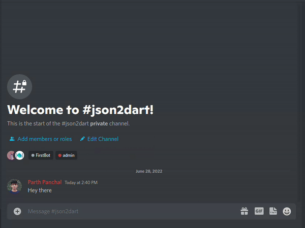
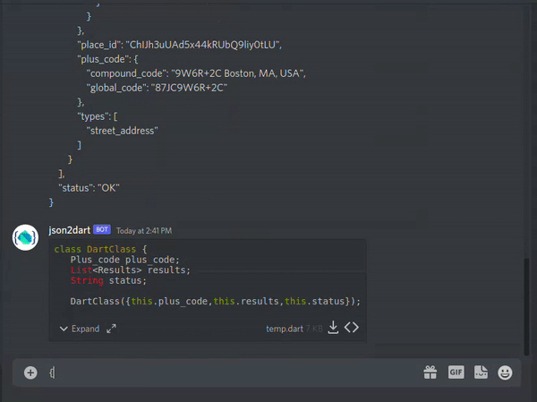

# json2dart

## _Discord bot to convert JSON code into Dart Class_

   

## How to use?

Step 1: Invite bot to your discord server using
below <a href="https://discord.com/api/oauth2/authorize?client_id=989037591980564480&permissions=2147519488&scope=bot%20applications.commands">
link.</a>

Step 2: DM your JSON code to `json2dart` bot `or` paste your JSON code to any text channel of your server.

## Use

##  

